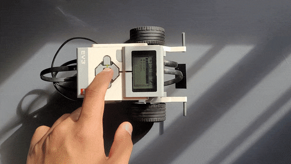

# Recursos-FLL
Base de recursos de programação para a FLL

# Andar em CM

    </img>

## Uso

### Requisitos

Para usar o bloco de Andar em Centímetros você deve ter realizado pelo menos uma vez os seguintes passos em alguma parte do código.

**Obrigatórios**:
- [**Definir os motores de movimento**](./Requisitos.md#definir-os-motores-de-movimento)

- [**Definir a circunferência da roda**](./Requisitos.md#definir-a-circunferência-da-roda)

- [**Definir o KP para  a correção de direção**](./Requisitos.md#definir-o-kp)
    > Pelo menos uma vez ou quando necessário

**Opcionais**:
- [**Definir o tipo de parada**](./Requisitos.md#definir-o-tipo-de-parada)

### Parâmetros
- **Centímetros**
    - Tipo: número
    - Descrição: A distância em centímetros desejada.

        > Valores positivos para ir para frente e negativos para ir para trás

- **Velocidade**
    - Tipo: Número
    - Descrição: A velocidade em % desejada.

        > Valores entre 0 e 100

- **Direção**
    - Tipo: Número
    - Descrição: A direção em graus (em relação ao ponto inicial) desejada.

        > Valores entre 0 e 359

## Exemplos
### Exemplo 1

    </img>

Anda 30 centímetros para frente na metade da velocidade máxima, tentando sempre se manter reto em 0 graus em relação a direção inicial.

    </img>
    </img> 

---
### Exemplo 2

    </img>

Anda 55 centímetros para trás com 40% da velocidade máxima, tentando sempre se manter a 90 graus da direção inicial

    </img>
    </img> 

