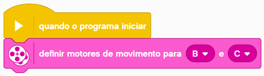
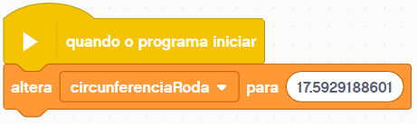
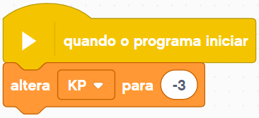
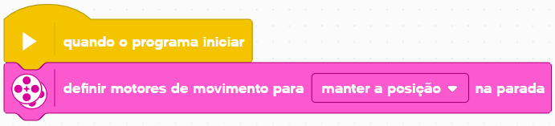

# Requisitos
Esse arquivo apresenta todas as configurações necessárias para o uso das programações.

# Definir os motores de movimento
Todos os blocos de movimentação do código estão configurados para usar os motores conectados nas portas **B e C** do brick ou hub, então você deve inicializá-los conforme o exemplo abaixo:

    </img>

> Note: só é necessário realizar essa configuração **uma vez**.

# Definir a circunferência da roda
A circunferência da roda é um valor utilizado para calcular uma distância em graus baseado numa distância em centímetros, e é um valor utilizado diversas vezes no código.

Você deve configurar o valor de acordo com a roda que está utilizando no seu robô, conforme o exemplo abaixo da roda padrão do kit educacional do EV3 (45544):

    </img>

> Note: só é necessário realizar essa configuração **uma vez**.

O valor da circunferência da sua roda pode ser obtido pelo cálculo `pi * diametro_roda` onde `diametro_roda` é o diâmetro da roda em centímetros, que você pode encontrar impresso no pneu (em milímetros) ou procurar por sua roda [nesse incrível site](http://wheels.sariel.pl).

# Definir o KP
O valor do KP (também chamado de **"Constante proporcional"** ou **"Fator de correção"**) é utilizado em correções proporcionais como um multiplicador.

Você deve configurar o seu valor de acordo com o seu robô, conforme o exemplo abaixo:

    </img>

Encontrar o KP ideal para o seu robô pode ser uma tarefa complicada, mas em geral basta analisar seus movimentos e seguir os seguintes passos:

- Se suas correções estão muito **fracas**, você deve **aumentar** o valor do KP;
- Se suas correções estão muito **bruscas**, causando outros erros, você deve **diminuir** o valor do KP;
- Se suas correções estão **invertidas** (indo para o lado errado), você deve **inverter o sinal** do KP (se era um número positivo, passa a ser negativo e vice-versa).

> Note: só é necessário realizar essa configuração **uma vez**, ou sempre que desejar usar um valor alternativo, como com um anexo, trajeto ou uma saída específica.

# Definir o tipo de parada
O tipo de parada é o que define o comportamento do robô quando ele finaliza seu movimento, e existem 2 principais tipos dele:

- **Manter a posição**
    > o robô mantém a posição atual, travando seus motores para não se mover;
- **Flutuar**
    > o robô corta a energia dos motores mas não os trava, e então ele para somente com a inércia.

Você deve configurar o seu tipo de parada conforme o exemplo abaixo:

    </img>

> Note: só é necessário realizar essa configuração **uma vez**, ou sempre que desejar usar um valor alternativo, como com um anexo, trajeto ou uma saída específica.

<!-- 

    </img>

 -->
